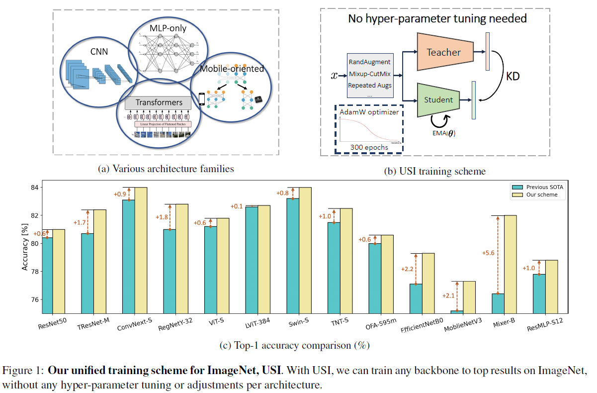
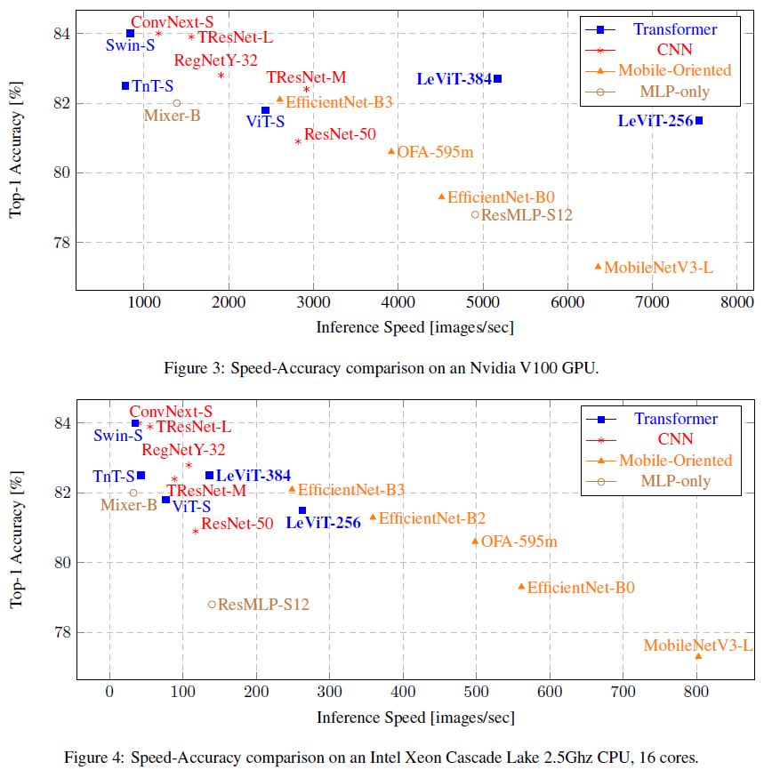

# Solving ImageNet: a Unified Scheme for Training any Backbone to Top Results

Official PyTorch Implementation
<br> [Paper](http://arxiv.org/abs/2204.03475) |
> Tal Ridnik, Hussam Lawen, Emanuel Ben-Baruch, Asaf Noy<br/> DAMO Academy, Alibaba
> Group

**Abstract**

ImageNet serves as the primary dataset for evaluating the quality of computer-vision models. The common practice today is training each architecture with a tailor-made scheme, designed and tuned by an expert.
In this paper, we present a unified scheme for training any backbone on ImageNet. The scheme, named USI (Unified Scheme for ImageNet), is based on knowledge distillation and modern tricks.  It requires no adjustments or hyper-parameters tuning between different models, and is efficient in terms of training times.
We test USI on a wide variety of architectures, including CNNs, Transformers, Mobile-oriented and MLP-only. On all models tested, USI outperforms previous state-of-the-art results. Hence, we are able to transform training on ImageNet from an expert-oriented task to an automatic seamless routine.
Since USI accepts any backbone and trains it to top results, it also enables to perform methodical comparisons, and identify the most efficient backbones along the speed-accuracy Pareto curve.

<p align="center">
 <table class="tg">
   <tr>
    <td class="tg-c3ow"></td>
  </tr>
</table>
</p>

## How to Train on ImageNet with USI scheme
The proposed USI scheme does not require hyper-parameter tuning. The base training configuration works well for any backbone.
All the results presented in the paper are fully reproducible.
First download model weights fromm [here](https://miil-public-eu.oss-eu-central-1.aliyuncs.com/model-zoo/USI/tresnet_l_v2_83_9.pth)

An example code - training ResNet50 model with USI:
```
python3 -u -m torch.distributed.launch --nproc_per_node=8 --nnodes=1 --node_rank=0 train.py  \
/mnt/Imagenet/
--model=resnet50
--kd_model_name=tresnet_l_v2
--kd_model_path=./tresnet_l_v2_83_9.pth
```

Some additional degrees of freedom that might be usefull:

- Adjusting the batch size (defualt - 128): ```--batch-size=...```
- Training for more epochs (default - 300): ```--epochs=...```

## Speed-Accuracy Comparisons
Our unified scheme allows us to perform methodical speed-accuracy comparisons, and identify efficient modern backbones on GPU and CPU

<p align="center">
 <table class="tg">
   <tr>
    <td class="tg-c3ow"></td>
  </tr>
</table>
</p>


## Acknowledgements

The training code is based on the excellent [timm repository](https://github.com/rwightman/pytorch-image-models).

## Citation
```
@misc{https://doi.org/10.48550/arxiv.2204.03475,
  doi = {10.48550/ARXIV.2204.03475},  
  url = {https://arxiv.org/abs/2204.03475},  
  author = {Ridnik, Tal and Lawen, Hussam and Ben-Baruch, Emanuel and Noy, Asaf},  
  keywords = {Computer Vision and Pattern Recognition (cs.CV), Machine Learning (cs.LG), FOS: Computer and information sciences, FOS: Computer and information sciences},  
  title = {Solving ImageNet: a Unified Scheme for Training any Backbone to Top Results},  
  publisher = {arXiv},  
  year = {2022},  
}  
```