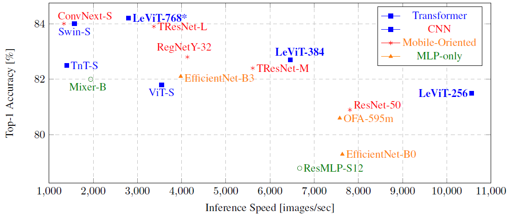
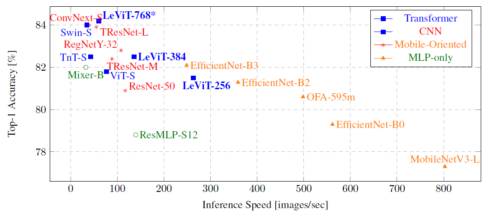

#  GPU TensorRT Speed-Accuracy Comparison
<!--
-->
<!-- <table class="tg">-->
   <tr>
    <td class="tg-c3ow"></td>
  </tr>
<!--</table>-->
<!--
-->

### Analysis and insights for GPU inference results:

- For low-to-medium accuracies, the most efficient models are LeViT-256 and LeViT-384
- For higher accuracies (> 83.5%), TResNet-L and LeViT-768* models provides the best trade-off among the models tested
- Other transformer models (Swin, TnT and ViT), provide inferior speed-accuracy trade-off compared to modern CNNs. Mobile-oriented models also do not excel on GPU inference
- Note that several modern architectures, titled ”Small” (ConvNext-S, Swin-S, TnT-S), are in fact quite resource-intensive - their inference speed is approximately three times slower compared to a plain ResNet50 model

#  CPU OpenVino Speed-Accuracy Comparison
<!--
-->
<!-- <table class="tg">-->
   <tr>
    <td class="tg-c3ow"></td>
  </tr>
<!--</table>-->
<!--
-->

### Analysis and insights for CPU inference results:
- On CPU, Mobile oriented models (OFA, MobileNet, EfficientNet) provide the best speed-accuracy trade-off
- LeViT models, who excelled on GPU inference, are not as efficient for CPU inference.
- Other transformer models (Swin, TnT and ViT) again provide inferior speed-accuracy trade-off.

# Implementation Details

Implementation details On GPU, The throughput was tested with TensorRT inference engine, FP16, and batch size of 256. On CPU, The throughput was tested using Intel’s
OpenVINO Inference Engine, FP16, a batch size of 1 and 16 streams (equivalent to the number of CPU cores). All measurements were done after models were optimized to inference by batch-norm fusion. This significantly accelerates
models that utilize batch-norm, like ResNet50, TResNet and LeViT. Note that LeViT-768* model is not a part of the original paper, but a model defined by us, to test LeViT design on higher accuracies regime.